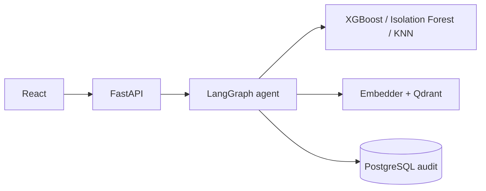

# Architecture

```mermaid
flowchart LR
  UI[React] --> API[FastAPI]
  API --> Agent[LangGraph agent]
  Agent --> ML[XGBoost / Isolation Forest / KNN]
  Agent --> RAG[Embedder + Qdrant]
  Agent --> DB[(PostgreSQL audit)]
```

Les réponses sont nettoyées par `security.py`, puis enrichies par les outils ML et RAG. Les traces sont conservées séparément pour audit.