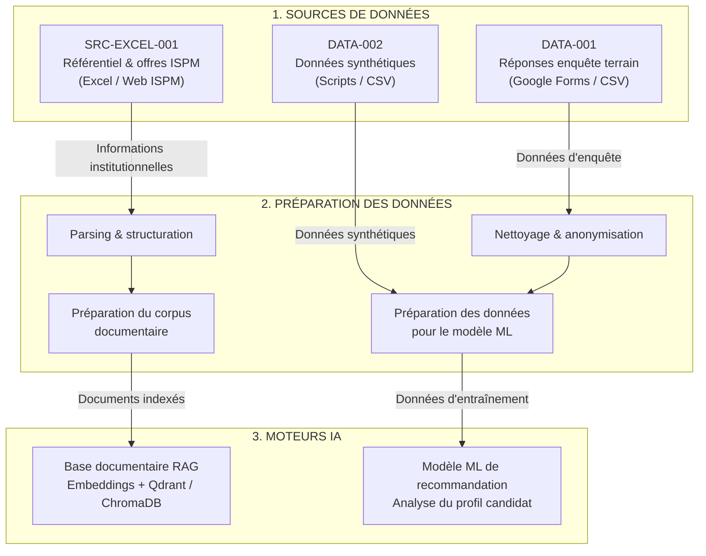
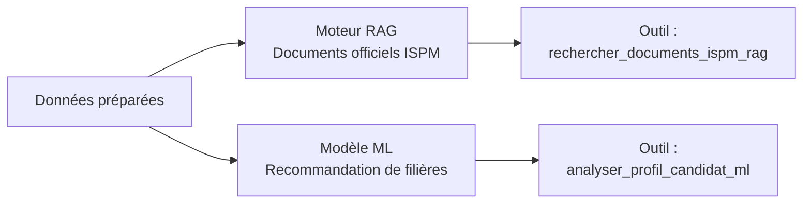
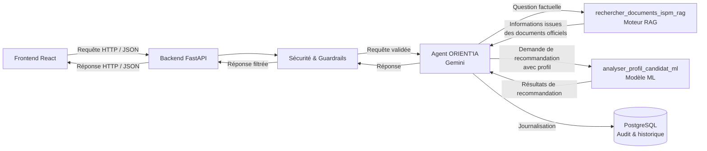
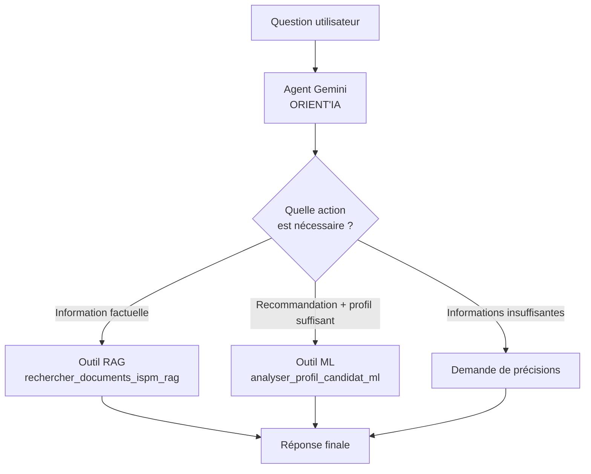
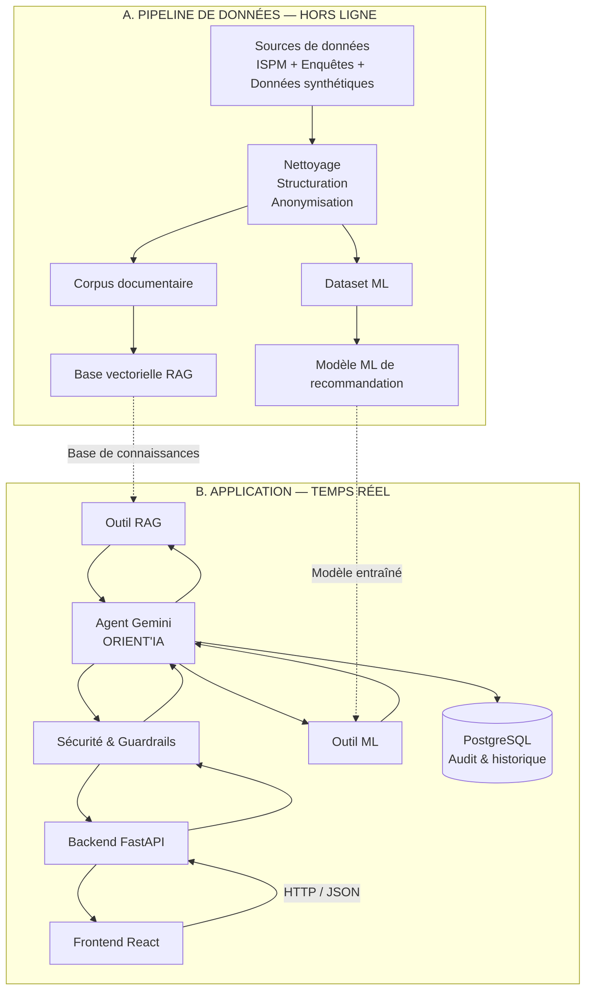

# Architecture du système ORIENT'IA

Ce document présente l'architecture globale de la plateforme **ORIENT'IA**, un assistant intelligent d'orientation académique de l'ISPM.

L'architecture est organisée en deux vues complémentaires :

1. **Architecture des données — Data Pipeline (hors ligne)** : collecte, préparation, nettoyage et transformation des données nécessaires au fonctionnement des moteurs RAG et ML.
2. **Architecture logicielle — Runtime (temps réel)** : traitement des requêtes utilisateurs par un agent Gemini capable de sélectionner directement les outils appropriés.

---

# 1. Architecture des données — Data Pipeline

Cette architecture décrit la préparation des différentes sources de données utilisées par ORIENT'IA.

Les données sont principalement utilisées pour construire deux composants :

* une **base documentaire RAG** contenant les informations officielles de l'ISPM ;
* un **modèle ML de recommandation** capable d'analyser le profil d'un candidat et de proposer les filières adaptées.



# 2. Construction des moteurs IA

Le pipeline de données permet de construire deux moteurs principaux.



## 2.1 Moteur RAG

Le moteur RAG permet à ORIENT'IA de rechercher des informations dans les documents officiels de l'ISPM.

L'utilisateur peut par exemple demander :

* « Quelles sont les matières de cette filière ? »
* « Combien coûtent les études ? »
* « Quels sont les parcours proposés ? »
* « Quelles sont les informations concernant cette formation ? »

Le système utilise alors l'outil :

`rechercher_documents_ispm_rag`

Le résultat est basé sur les documents institutionnels indexés dans la base vectorielle.

---

## 2.2 Modèle ML de recommandation

Le modèle ML est utilisé lorsqu'un utilisateur souhaite obtenir une recommandation de filière à partir de son profil.

Exemple :

> « Je suis une personne sociable, j'aime voyager et communiquer avec les autres. Quelle filière pourrait me convenir ? »

L'agent peut alors utiliser :

`analyser_profil_candidat_ml`

Le modèle analyse les caractéristiques du profil et produit une recommandation.

---

# 3. Architecture logicielle — Runtime

Contrairement à une architecture utilisant un classifieur d'intentions séparé, **ORIENT'IA utilise directement un agent Gemini pour comprendre la demande et choisir l'outil approprié**.

Le système ne possède donc pas de composant `CLASSIFIER` dédié.

Le modèle Gemini agit comme **orchestrateur intelligent**.



---

# 4. Rôle de l'agent Gemini

L'agent Gemini constitue le cœur de l'architecture temps réel.

Il reçoit directement la question de l'utilisateur et détermine, à partir des instructions du système et des outils disponibles, quelle action effectuer.



## 4.1 Décision basée sur les outils

La sélection de l'outil n'est pas réalisée par un classifieur d'intentions externe.

Elle est effectuée directement par Gemini grâce au **tool calling**.

Les outils disponibles sont :

```python
tools = [
    analyser_profil_candidat_ml,
    rechercher_documents_ispm_rag
]
```

L'agent dispose donc de deux capacités principales :

| Outil                           | Utilisation                                                     |
| ------------------------------- | --------------------------------------------------------------- |
| `rechercher_documents_ispm_rag` | Rechercher des informations officielles dans les documents ISPM |
| `analyser_profil_candidat_ml`   | Analyser le profil d'un candidat et recommander des filières    |

Lorsque les informations fournies par l'utilisateur sont insuffisantes pour effectuer une recommandation, l'agent peut demander des précisions avant d'appeler le modèle ML.

---

# 5. Prompt et règles de l'agent

Le comportement de l'agent est défini par un prompt système.

Les principales règles sont :

* utiliser le RAG pour les questions factuelles concernant les formations ;
* utiliser le modèle ML lorsqu'une recommandation est demandée et que le profil est suffisamment renseigné ;
* demander des précisions lorsque le profil fourni est insuffisant ;
* indiquer systématiquement la provenance des informations utilisées.

Le principe est donc :

```text
Question utilisateur
        │
        ▼
   Agent Gemini
        │
        ├──► Information institutionnelle
        │          │
        │          ▼
        │       RAG ISPM
        │
        ├──► Demande de recommandation
        │          │
        │          ▼
        │       Modèle ML
        │
        └──► Informations insuffisantes
                   │
                   ▼
             Demande de précisions
```

---

# 6. Architecture complète

La combinaison du pipeline de données et de l'architecture runtime donne la vue globale suivante :



---

# 7. Résumé de l'architecture

L'architecture ORIENT'IA repose sur trois composants intelligents principaux :

### 1. Agent Gemini

Il constitue le **cerveau de l'application**.

Il comprend la demande de l'utilisateur et décide directement quel outil utiliser grâce au mécanisme de **tool calling**.

### 2. Moteur RAG

Il fournit des réponses basées sur les **documents officiels de l'ISPM**.

Il est utilisé pour les demandes nécessitant des informations factuelles et vérifiables.

### 3. Modèle ML

Il analyse le **profil du candidat** afin de produire des recommandations de filières.

Cette séparation permet de distinguer :

* les informations provenant des **documents institutionnels** ;
* les recommandations provenant du **modèle ML**.

L'agent Gemini assure l'orchestration entre ces deux capacités.

---

# 8. Flux global d'une requête

```text
┌─────────────────────┐
│    Utilisateur      │
└──────────┬──────────┘
           │
           ▼
┌─────────────────────┐
│    Frontend React   │
└──────────┬──────────┘
           │ HTTP / JSON
           ▼
┌─────────────────────┐
│    Backend FastAPI  │
└──────────┬──────────┘
           │
           ▼
┌─────────────────────┐
│ Sécurité & Guardrails│
└──────────┬──────────┘
           │
           ▼
┌─────────────────────┐
│    Agent Gemini     │
│    ORIENT'IA        │
└──────────┬──────────┘
           │
     ┌─────┴─────┐
     │           │
     ▼           ▼
┌─────────┐  ┌─────────┐
│   RAG   │  │   ML    │
│ ISPM    │  │Profil   │
└────┬────┘  └────┬────┘
     │            │
     └──────┬─────┘
            ▼
   ┌─────────────────┐
   │ Réponse finale  │
   └────────┬────────┘
            ▼
   ┌─────────────────┐
   │ Frontend React  │
   └─────────────────┘
```

**Principe architectural :**

> **Gemini ne prédit pas une intention prédéfinie : il raisonne sur la demande et choisit directement l'outil adapté.**

Cela simplifie l'architecture en supprimant la couche de classification d'intentions et permet d'ajouter ultérieurement de nouveaux outils à l'agent sans devoir modifier un classifieur d'intentions.
